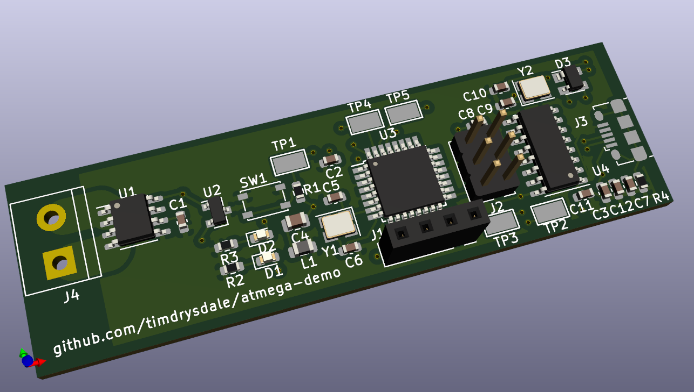
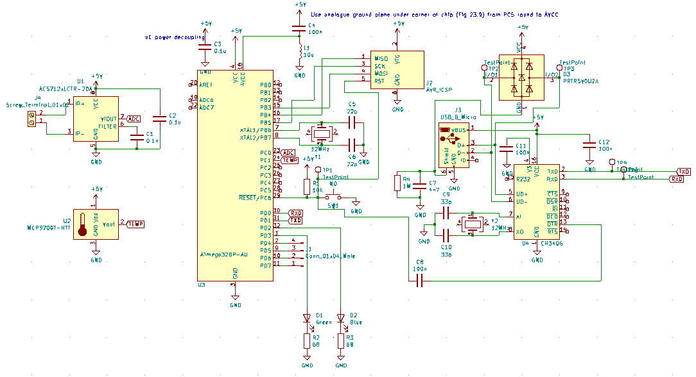

# atmega-demo
PCB to demonstrate atmega microcontroller together with ACS712 and temperature sensor.

## Purpose

This board will be used to monitor power consumption and temperature in remote lab boxes.

## Schematic

The key components are an Atmega328P, a CH340 USB transceiver, an ACS712 current sensor and a simple analog temperature sensor. DTR reset is enabled to support re-programming over USB, while ICSP header is supplied for initial programming. Both CH340 and Atmega are using 12MHz crystals, which yields 0.1% baud rate error at 57600 baud for the Atmega.

## BOM

|Comment             |Designator         |Footprint                                                 |LCSC    |
|--------------------|-------------------|----------------------------------------------------------|--------|
|0.1n                |C1                 |Capacitor_SMD:C_0603_1608Metric                           |C100040 |
|100n                |C8,C11,C12         |Capacitor_SMD:C_0603_1608Metric                           |C14663  |
|0.1u                |C2,C3              |Capacitor_SMD:C_0603_1608Metric                           |C14663  |
|100n                |C4                 |Capacitor_SMD:C_0805_2012Metric                           |C49678  |
|22p                 |C5,C6              |Capacitor_SMD:C_0603_1608Metric                           |C1653   |
|4n7                 |C7                 |Capacitor_SMD:C_0603_1608Metric                           |C53987  |
|33p                 |C9,C10             |Capacitor_SMD:C_0603_1608Metric                           |C1663   |
|Green               |D1                 |LED_SMD:LED_0603_1608Metric                               |C72043  |
|Blue                |D2                 |LED_SMD:LED_0603_1608Metric                               |C72043  |
|PRTR5V0U2X          |D3                 |Package_TO_SOT_SMD:SOT-143                                |C2827688|
|Conn_01x04_Male     |J1                 |Connector_PinSocket_2.54mm:PinSocket_1x04_P2.54mm_Vertical|        |
|AVR_ICSP            |J2                 |Connector_PinHeader_2.54mm:PinHeader_2x03_P2.54mm_Vertical|        |
|USB_B_Micro         |J3                 |Connector_USB:USB_Micro-B_Amphenol_10118194_Horizontal    |C132563 |
|Screw_Terminal_01x02|J4                 |TerminalBlock:TerminalBlock_bornier-2_P5.08mm             |        |
|10u                 |L1                 |Inductor_SMD:L_0805_2012Metric                            |C1046   |
|10K                 |R1                 |Resistor_SMD:R_0603_1608Metric                            |C25804  |
|68                  |R2,R3              |Resistor_SMD:R_0603_1608Metric                            |C27592  |
|1M                  |R4                 |Resistor_SMD:R_0603_1608Metric                            |C22935  |
|NO                  |SW1                |Button_Switch_SMD:SW_SPST_PTS810                          |C116501 |
|TestPoint           |TP1,TP2,TP3,TP4,TP5|TestPoint:TestPoint_Keystone_5015_Micro-Minature          |C238130 |
|ACS712xLCTR-20A     |U1                 |Package_SO:SOIC-8_3.9x4.9mm_P1.27mm                       |C10681  |
|MCP9700T-HTT        |U2                 |Package_TO_SOT_SMD:SOT-23                                 |C150830 |
|ATmega328P-AU       |U3                 |Package_QFP:TQFP-32_7x7mm_P0.8mm                          |C14877  |
|CH340G              |U4                 |Package_SO:SOIC-16_3.9x9.9mm_P1.27mm                      |C14267  |
|12MHz               |Y1,Y2              |Crystal:Crystal_SMD_3225-4Pin_3.2x2.5mm                   |C97242  |
