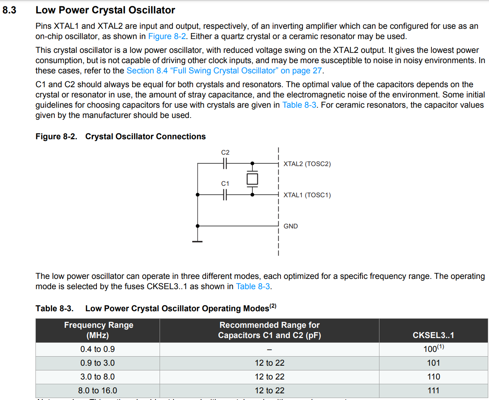
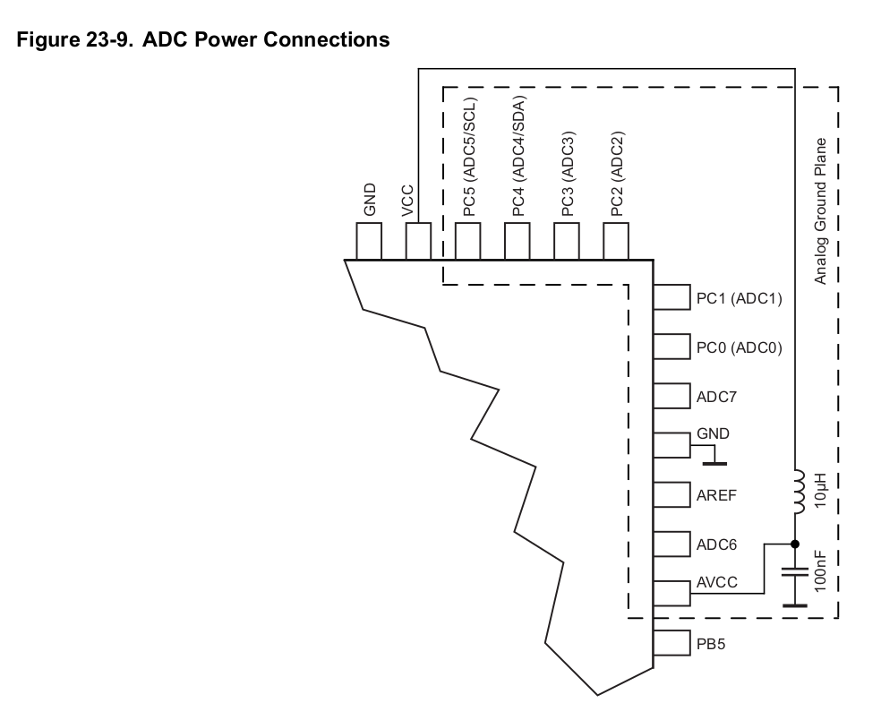

# DESIGN DESCRIPTION TEMPLATE

## Background

This board is to demonstrate self-assembled Atmega328P circuit.

## Specification

Arduino with USB programming, current sensor, and temp sensor.

Possibly reverse polarity protection, and/or level shifter and external connections headers.

### Design tradeoffs

Note any issues which could be handled in more than one way and justify the approach taken?

### Design for assembly

How will you put it together e.g. if using cable connections, how will these be manufactured?

### Design for reliability

Things go wrong with assembly and usage, even with the best of staff working on the job. So how will your design prevent itself from being damaged by accidental or even malicious misuse, e.g. reversed power supplies, or wrong power supply, incorrect peripheral connections etc (especially where terminal blocks are used, because polarity cannot be enforced very easily).

### Design for maintenance 

What parts are likely to fail, and how will they be replaced?

## Part  details

List here any helpful details which can assist in the review process, such

### Atmega 328P-AU

JLCPCB Part# C14877
Package TQFP-32_7.0x7.0x0.8P
Price ca. $6

KiCAD footprint: Package_QFP:TQFP-32_7x7mm_P0.8mm

Added LCSC code to part in schematic

#### Clock

Since want to use USB, need a crystal (else [reported](https://electronics.stackexchange.com/questions/27763/using-the-atmega328-with-the-internal-oscillator) 10% variation in the clock frequency, i.e. outside acceptable range for USB clock speeds.

Internal oscillator calibration procedure is [here](http://projects.gctronic.com/elisa3/AVR053-Calibration-RC-oscillator.pdf) for reference - don't use that for now though.

There are some suggested oscillator frequencies
3.6864MHz (0% error for 230.4k Baud and under)
4.0000MHz (0.2 - 8.5% errors)
7.3728MHz (0% error for 230.4kBaud and under)

Some issues with clocks >8 MHz depending on VCC - to avoid issues, try 4 MHz clock for now.

### Oscillator

Yangxing Tech X49SM36864MSD2SC-1

JLCPCB Part # C2238
Package HC-49S
Description -20℃~70℃ 49SMD ±20ppm 20pF 150Ω 3686400Hz HC-49S/SMD Crystals ROHS
SMT Assembly
Price 6c / min 5
Extended part

Note:- 

also good is 14.7456MHz

but put in 18pF-22pF caps as suggested [here](https://www.arduino.cc/en/Tutorial/BuiltInExamples/ArduinoToBreadboard)

### Oscillator capacitors

since 3 - 8 MHz oscillator, Table 8-3 says want 12 - 22pF

Use 0805 size as lots in stock.

Manufacturer: 0805CG120J500NT

C1792 Basic part

Footprint: Capacitor_SMD:C_0805_2012Metric

### Reset switch
Manufacturer C&K
MFR.Part # PTS810SJM250SMTRLFS
JLCPCB Part # C116501
Package KEY-SMD
Description Top Actuated 50mA @ 16VDC Round Button SPST SMD Tactile Switches ROHS
Source LCSC
Assembly Type SMT Assembly

Footprint dimensions checked manually
Button_Switch_SMD:SW_SPST_PTS810

### 5K pull up

C78980

250mW

0805

### Analog filter

100nF cap C49678 0805 basic part
footprint:Capacitor_SMD:C_0805_2012Metric

10uH inductor C1046 basic part
(confirmed value by checking part code in table in datasheet SDFL2012S100KTF)
footprint: Inductor_SMD:L_0805_2012Metric

#### Sourcing

Where can you get it from?

#### Size, orientation

How big is it, and which way round does the footprint need to be on the PCB? How much clearance is needed around the part e.g. for putting in wires to terminal blocks

#### Supply considerations

What is the typical, and absolute supply voltage(s)?

#### Application considerations

What supporting components are needed? 

#### Electromagnetic compatibility considerations

Note any components which should be close together, far apart, and any track length considerations

